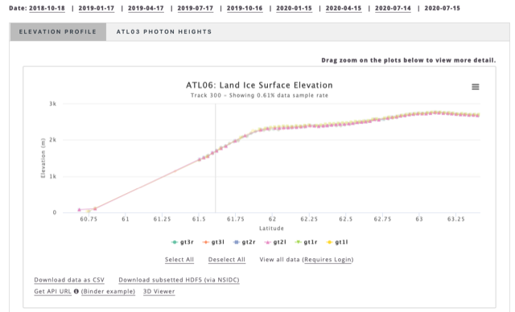

# Open Altimetry

Open Altimetry (https://openaltimetry.org) is a data exploration and visualization service for ICESat-2* (and ICESat) data. It allows users to interactively explore data from the laser altimeter missions. Users can select specific days or ground tracks on global map. For ICESat-2, several track (Level 3A) products are currently available – land ice height, sea ice height and freeboard, ocean surface height, and inland water surface height; the geolocated photon (Level 2) data are also available. 

- MODIS True Color composite imagery from NASA WorldView can be applied as a base map to indicate ground and sky conditions (e.g., clouds may block surface retrievals from the visible lasers). 
- A subset region can be selected and the data and photon cloud for tracks from that region can be plotted. 
- The track data for the region can then be downloaded as a simple CSV file or as a subsetted HDF5 file through EarthData Search and the NSIDC DAAC (a NASA EarthData account is required). 
- Another access capability is through an API. 
- There is also the capability to create and save “annotations” for notable events. 

The interface is regularly updated as new data is released and new features are also added. 

OpenAltimetry is funded by NASA and is a collaboration between the National Snow and Ice Data Center, the Scripps Institution of Oceanography, and the Supercomputer Center at the University of California San Diego. 

*ICESat and ICESat-2 are the NASA Ice, Cloud, and land Elevation Satellite missions, both of which carry laser altimeter instruments. ICESat operated from 2003 through 2009; ICESat-2 was launched in September 2018 and is providing regularly updated data. More on the ICESat and ICESat-2 can be found at NASA: https://icesat.gsfc.nasa.gov. Data from both missions are archived by the NASA Snow and Ice Distributed Active Archive Center (DAAC) at NSIDC (https://nsidc.org/data/icesat-2/ and https://nsidc.org/data/icesat) and through the NASA ESDIS EarthData website (https://earthdata.nasa.gov).* 

*Main interface of OpenAltimetry*

    
     
*Plot of land ice elevation (ATL06) over Greenland on 15 July 2020 (Track ID 300)*

