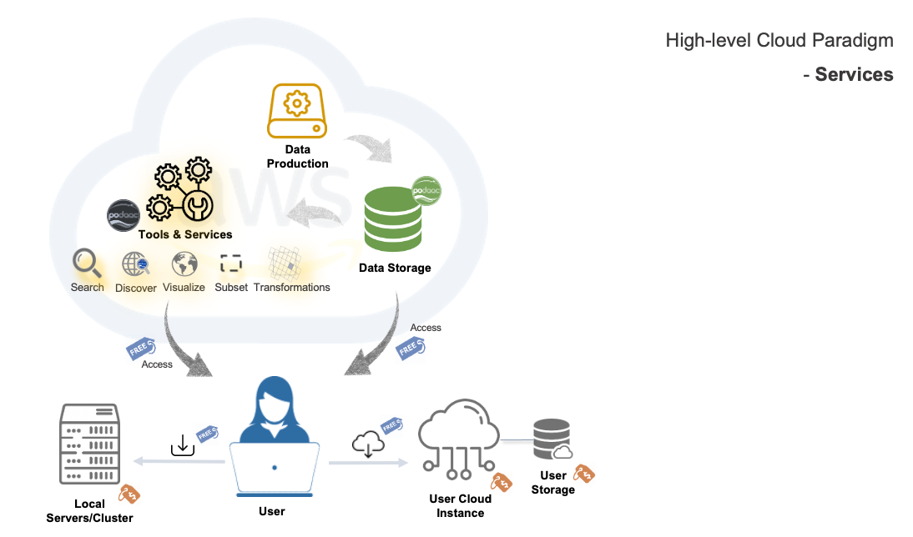

# AGU 2020 tutorials 

## Summary 

### Access coincident sea ice and ocean data to study melt pond characteristics

Notes:

* Help user narrow down the amount of data needed for a given need. Especially relevant when working with big data volumes. Some data is cloud-based, some is still on prem, user can work with both types of data regardless of whether in the cloud or not.

* subset by bounding box
* Harmony (L2SS) API

Data and Resources:

* ATL07 sea ice height (NSIDC DAAC)
* MODIS SST L2 (PODAAC) 

Cloud workflow:

     

### Learning objectives:
1. Select NASA Earthdata sea ice and sea surface temperature datasets
2. Identify data file size and availability over time and geographic bounding box
3. Subset and download data using an Application Programmatic Interface (API)
4. Plot and compare coincident data values

## Authors

Amy Steiker (@asteiker), NASA National Snow and Ice Data Center Distributed Active Archive Center (NSIDC DAAC), University of Colorado

Andrew Barrett (@andypbarrett), National Snow and Ice Data Center, University of Colorado

Matt Fisher (@MattF-NSIDC), NASA National Snow and Ice Data Center Distributed Active Archive Center (NSIDC DAAC), University of Colorado

Patrick Quinn (@bilts), Element84, NASA EOSDIS

Walt Meier, NASA National Snow and Ice Data Center Distributed Active Archive Center (NSIDC DAAC), University of Colorado